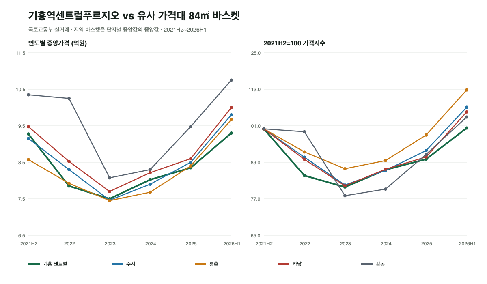

# 기흥역센트럴푸르지오 심층 분석

기준일: 2026-06-28

## 1. 결론

**실거주 후보로는 유지하되, 9.9억원과 10.3억원을 같은 가격대로 보면 안 된다.**

- 1,316세대 대단지, 2018년 사용승인, 기흥역 도보권, 한얼초 인접, AK&기흥 생활권은 명확한 장점이다.
- 전용 84㎡ 거래가 5년간 428건으로 비교 단지보다 유동성이 높고, 2026년 4~6월 가격 회복이 뚜렷하다.
- 최근 12개월 150건 중앙값은 9.0억원, 2026년 상반기 중앙값은 9.3억원, 2026년 6월 중앙값은 9.67억원이다.
- 9.9억원은 최근 12개월 거래의 약 96백분위, 10.3억원은 약 99백분위다. 10.3억원은 일반적인 시세가 아니라 최근 최상단 거래에 해당한다.
- 9.9억원은 2026년 5~6월 중·고층 또는 선호 타입과 비교해 협상 가능한 범위다. 10.2억~10.3억원은 동일 동·타입·향·조망의 10.2억·10.4억원 거래를 재현할 수 있을 때만 검토해야 한다.

### 가격 판단선

| 계약가 | 판단 | 필수 확인 |
|---:|---|---|
| 9.6억 이하 | 우호적 | 하자·저층·비선호 향 여부 확인 |
| 9.6억~9.9억 | 합리적 검토 구간 | 2026년 5~6월 동일 타입 비교 |
| 10.0억~10.15억 | 프리미엄 구간 | 고층·골프장뷰·내부상태 등 명확한 보상 필요 |
| 10.2억~10.3억 | 추격매수 경계 | 동일 타입 최근 10.2억·10.4억 거래와 완전 비교 |

## 2. 단지 기본정보

| 항목 | 확인값 | 신뢰도·출처 |
|---|---|---|
| 단지명 | 기흥역센트럴푸르지오 | 국토부 실거래 |
| 소재지 | 용인시 기흥구 구갈동 | 국토부·단지 정보 |
| 사용승인 | 2018년 6~7월 | 국토부 건축년도·단지 정보 교차확인 |
| 세대수 | 1,316세대 | 단지 정보·중개 매물 정보 |
| 동수 | 6개동 | 단지 정보 |
| 최고층 | 49층 | 단지 정보 |
| 주차 | 1,647대, 세대당 약 1.25대 | 중개 매물 정보, 현장 재확인 필요 |
| 난방 | 지역난방 | 단지 정보 |
| 주거유형 | 500세대 이상 주상복합 아파트 | 프로젝트 분류 기준상 포함 |
| 면적 | 아파트는 전용 84㎡ 중심 | 국토부 실거래 면적 |
| 역 접근 | 기흥역 직선거리 약 337m, 도보 추정 6분 | 카카오 로컬 직선거리 추정 |
| 교통 | 수인분당선·용인에버라인 환승 | 철도 노선 정보 |

K-apt API는 현재 서비스별 활용승인 문제로 직접 응답을 확보하지 못했다. 주차·관리비·커뮤니티 세부값은 관리사무소 원문과 현장 게시물로 최종 확인해야 한다.

## 3. 최근 가격과 거래

분석 범위는 전용 82~86㎡, 2021년 7월~2026년 6월 국토교통부 실거래다.

| 기간 | 거래수 | 최저 | 중앙값 | 최고 |
|---|---:|---:|---:|---:|
| 2021년 하반기 | 32 | - | 9.275억 | - |
| 2022년 | 45 | - | 7.85억 | - |
| 2023년 | 79 | - | 7.50억 | - |
| 2024년 | 80 | - | 8.025억 | - |
| 2025년 | 111 | - | 8.35억 | - |
| 2026년 상반기 | 81 | 7.80억 | **9.30억** | 10.40억 |

### 최근 12개월 분포

| 지표 | 가격 |
|---|---:|
| 최저 | 7.70억 |
| 25백분위 | 8.5075억 |
| 중앙값 | 9.00억 |
| 75백분위 | 9.30억 |
| 최고 | 10.40억 |
| 9.9억원 위치 | 약 96백분위 |
| 10.3억원 위치 | 약 99.3백분위 |

### 2026년 월별 중앙값

| 월 | 거래수 | 중앙값 | 최고 |
|---|---:|---:|---:|
| 1월 | 12 | 9.025억 | 9.50억 |
| 2월 | 8 | 9.20억 | 9.67억 |
| 3월 | 11 | 9.00억 | 9.37억 |
| 4월 | 17 | 9.10억 | 9.75억 |
| 5월 | 16 | 9.55억 | 9.95억 |
| 6월 | 17 | **9.67억** | **10.40억** |

6월 상승은 실제 거래수 17건을 동반해 단일 거래만의 움직임은 아니다. 다만 10억원 이상 거래는 전체 분포의 상단이므로, 평균적인 매물에 그대로 적용하면 안 된다.

### 최근 최고가 거래

| 계약월 | 전용면적 | 층 | 거래가 |
|---|---:|---:|---:|
| 2026.06 | 84.9079㎡ | 14층 | 10.40억 |
| 2026.06 | 84.7384㎡ | 8층 | 10.20억 |
| 2026.06 | 84.7384㎡ | 39층 | 10.15억 |
| 2026.06 | 84.7384㎡ | 28층 | 10.08억 |
| 2026.06 | 84.9079㎡ | 23층 | 10.00억 |
| 2026.05 | 84.7384㎡ | 18층 | 9.95억 |

거래가가 층수와 단순 비례하지 않는다. 타입, 향, 골프장 조망, 내부수리, 특수거래 여부를 함께 확인해야 한다.

## 4. 수지·평촌·하남·강동 5년 비교

### 비교 방법

- 동일 전용면적 범위 82~86㎡만 사용했다.
- 최근 가격이 기흥 센트럴과 유사하고 5년 거래표본이 확보된 단지를 지역별 5개 선정했다.
- 지역값은 거래량이 많은 한 단지가 결과를 지배하지 않도록 `단지별 연도 중앙값의 중앙값`으로 계산했다.
- 2021년은 7~12월, 2026년은 1~6월 자료다.
- 재건축 기대, 연식, 입지와 상품성이 달라 가격 예측모형이 아니라 동일 예산의 대안 비교다.

### 비교 바스켓

| 지역 | 포함 단지 |
|---|---|
| 수지 | 신명스카이뷰, 대지마을현대홈타운3차2단지, 포레나광교상현, 써니벨리, 힐스테이트광교산 |
| 평촌 | 은하수청구, 한가람두산, 한가람한양, 한가람삼성, 무궁화효성 |
| 하남 | 하남힐즈파크푸르지오2단지, 미사강변한신휴플러스, 대명강변타운, 하남풍산아이파크 1·5단지 |
| 강동 | 현대1, 동아하이빌, 암사e편한세상, 암사동한솔, 우성 |

### 연도별 중앙가격

| 지역 | 2021H2 | 2022 | 2023 | 2024 | 2025 | 2026H1 |
|---|---:|---:|---:|---:|---:|---:|
| 기흥 센트럴 | 9.275억 | 7.85억 | 7.50억 | 8.025억 | 8.35억 | **9.30억** |
| 수지 바스켓 | 9.1525억 | 8.30억 | 7.4625억 | 7.90억 | 8.50억 | **9.80억** |
| 평촌 바스켓 | 8.575억 | 7.925억 | 7.45억 | 7.68억 | 8.40억 | **9.67억** |
| 하남 바스켓 | 9.475억 | 8.525억 | 7.70억 | 8.215억 | 8.60억 | **10.00억** |
| 강동 바스켓 | 10.35억 | 10.25억 | 8.075억 | 8.30억 | 9.48억 | **10.75억** |

### 2021H2 대비 변화

| 지역 | 2021H2→2026H1 | 2023 저점 대비 회복 | 2026H1 지수 |
|---|---:|---:|---:|
| 기흥 센트럴 | **+0.3%** | +24.0% | 100.3 |
| 수지 | +7.1% | +31.3% | 107.1 |
| 평촌 | +12.8% | +29.8% | 112.8 |
| 하남 | +5.5% | +29.9% | 105.5 |
| 강동 | +3.9% | +33.1% | 103.9 |

### 기흥이 수지를 따라가는가

- 6개 기간의 가격 수준 상관계수는 약 **0.94**, 기간별 변동률 상관계수는 약 **0.91**로 방향성은 상당히 유사하다.
- 2023년 저점 형성과 2024~2026년 회복 방향은 수지와 거의 같이 움직였다.
- 그러나 2026년 상반기 지수는 기흥 100.3, 수지 107.1로 기흥이 약 6.8포인트 뒤처진다.
- 2026년 상반기 중앙가격도 기흥 9.3억, 수지 9.8억으로 약 5천만원 차이다.
- **결론: 기흥은 수지의 방향을 따라가지만 상승률까지 완전히 따라잡지는 못했다.** 10.3억원에 매수하면 현재 수지 유사 바스켓 중앙가격 9.8억원보다 높은 가격을 지불하므로 `수지 대비 할인` 논리가 사라진다.

## 5. 실거주 장점

1. **대단지 유동성**: 전용 84㎡ 5년 거래가 428건으로 매도 시 가격발견과 거래 상대 확보에 유리하다.
2. **역 접근성**: 기흥역 수인분당선과 용인에버라인을 도보권에서 이용한다.
3. **정자동 출퇴근**: 수인분당선으로 정자역까지 환승 없이 이동할 수 있어 사용자 직장과 방향이 맞다.
4. **준신축 상품성**: 2018년 사용승인으로 구축 선택지보다 설비와 공용부가 새롭다.
5. **한얼초 인접**: 초등학교 접근성이 단지 선택의 강한 장점으로 반복 언급된다.
6. **생활 인프라**: AK&기흥과 기흥역 상권을 걸어서 이용할 수 있다.
7. **대단지 커뮤니티·관리 효율**: 1,316세대 규모는 커뮤니티 운영과 관리비 분산에 유리할 가능성이 있다.
8. **조망 선택지**: 일부 타입의 수원CC 골프장 조망과 3면창이 프리미엄 요소로 언급된다.
9. **동질적 면적 구성**: 전용 84㎡ 중심이라 실거주 수요층이 명확하다.
10. **기흥역 생활권 내 상대적 대장성**: 기흥역 신축군 중 세대수·브랜드·거래량이 강하다.

## 6. 단점과 리스크

1. **높은 용적률과 건폐율**: 용적률 약 449%, 건폐율 약 67%로 저밀도 아파트의 조경·개방감과는 다르다.
2. **주상복합 특성**: 상가·유동인구·차량 동선과 주거동 프라이버시를 현장에서 확인해야 한다.
3. **가격 상단 진입**: 9.9억~10.3억은 최근 12개월의 96~99백분위다.
4. **중학교 공백**: 초등학교는 가깝지만 기흥역세권 중학교는 아직 추진 단계다.
5. **주차 여유 제한 가능성**: 세대당 약 1.25대로 1,316세대 맞벌이 가구의 2대 차량 수요에는 넉넉하다고 단정하기 어렵다.
6. **교통 혼잡**: 역세권 상업시설과 대단지 입출차가 겹치는 출퇴근 시간 차량 동선을 확인해야 한다.
7. **타입별 가격 편차**: 같은 84㎡라도 면적 코드, 향, 조망과 내부상태에 따라 거래가 차이가 크다.
8. **학원가 선택지**: 수지·평촌의 성숙한 학원가와 비교하면 지역 내 선택 폭을 직접 검증해야 한다.
9. **플랫폼시티 수혜의 거리**: 구성역 중심 개발이라 기흥역에 즉시 같은 프리미엄이 붙는 것은 아니다.
10. **향후 공급 경쟁**: 플랫폼시티와 기흥역세권 추가 개발은 인프라 호재인 동시에 신축 공급 경쟁이다.
11. **고층 생활 리스크**: 강풍, 엘리베이터 대기, 이사·화재 대피, 창호 소음은 동·층별 확인이 필요하다.
12. **수지 추격의 한계**: 방향은 따라가지만 최근 5년 누적 회복률은 수지보다 낮다.

## 7. 기흥 호재와 확실성

| 호재 | 현재 상태 | 센트럴푸르지오 영향 | 확실성 | 리스크 |
|---|---|---|---|---|
| GTX-A 구성역 | 2024년 개통 | 기흥역에서 수인분당선 2정거장 후 환승 가능 | 높음 | 환승시간 때문에 직접 역세권보다 효과 약함 |
| 경기용인 플랫폼시티 | 2025.03 착공식, 2030 준공 목표 보도 | 일자리·상업·광역교통 기반 확대 | 중상 | 구성·보정 중심, 일정·공급량 변동 가능 |
| 삼성전자 기흥 NRD-K | 차세대 R&D 투자 진행, 2030년까지 대규모 투자 보도 | 고소득 배후수요와 기흥 산업기반 강화 | 중상 | 기업 투자일정과 고용 파급은 변동 가능 |
| 용인 첨단시스템반도체 국가산단 | 국가산단 승인·보상 절차 | 용인 전체 일자리·인지도 상승 | 중 | 처인구 중심이라 기흥역 직접효과는 제한적 |
| 기흥역세권 중학교 | 시·교육청이 재배치·통합학교 방안 추진 | 교육 약점 보완 가능 | 중하 | 부지·방식·개교시점 미확정 |
| 용인경전철 광교 연장 | 경기도 도시철도망 반영 보도, 사전타당성 단계 | 광교 접근성과 에버라인 가치 상승 가능 | 중하 | 예타·재원·노선 확정 전 |
| 기흥역세권2 개발 | 민간 개발 추진 이력 | 상권·주거축 확장 가능 | 낮음 | 법적·사업추진 논란과 일정 불확실성 |

호재는 이미 개통된 GTX-A 구성역을 제외하면 `가격에 즉시 전액 반영할 확정 현금흐름`이 아니다. 10.3억원을 호재만으로 정당화하면 안 된다.

## 8. 블로그·현장 후기 검토

블로그는 검색 API로 수집했으며 광고·중개·경매·시공업체 글이 많다. 독립 임장·실거주 글의 신호를 우선하고, 단지 수치와 가격은 공공데이터로 분리 검증했다.

### 반복된 긍정 신호

- 기흥역 평지 도보권
- 한얼초 인접
- AK&기흥과 단지 상가
- 준신축 공용부와 대단지
- 일부 타입 골프장 조망·3면창
- 기흥역 신축군 중 센트럴 선호

### 반복된 확인 필요 신호

- 중학교 부재 또는 거리
- 역·상가 인접 유동인구와 복잡성
- 주차 1.25대의 실제 야간 여유
- 주상복합의 관리비와 상가 동선
- 고층 엘리베이터 대기·바람·창호 소음
- 욕실 타일 들뜸 등 개별 세대 하자 사례

### 검토 출처

| 유형 | 제목 | URL | 활용 |
|---|---|---|---|
| 실거주 | 기흥역 센트럴 푸르지오 실거주 후기 | https://blog.naver.com/mongddang16/223954857330 | 평지·역·학교·생활 체감 |
| 임장 | 기흥역 센트럴 푸르지오 아파트 단지 분위기 임장 | https://blog.naver.com/vpinkpink/223568482087 | 단지·상권 분위기 |
| 임장 | 기흥역세권 구갈동 임장기 | https://blog.naver.com/willdoanything4u/224242479130 | AK&기흥 상권 수준 |
| 임장 | 지혜로운 임장 기흥역세권 | https://blog.naver.com/jithrough/223892991616 | 인근 신축군 비교 |
| 임장 | 기흥역 대장아파트 임장 | https://blog.naver.com/dively_money/223013275611 | 상권·유동인구·사생활 |
| 임장 | 기흥역 신축 임장 | https://blog.naver.com/clean0073/223079562843 | 단지 상가와 학교 |
| 임장 | 용인 기흥역세권 임장 | https://blog.naver.com/next-door_mentor/223398517409 | 경기남부 비교·상승 한계 |
| 구조 | C1타입 구조 알아보기 | https://blog.naver.com/rosbd2/223774966009 | 3면창·골프장 조망 |
| 단지정보 | 202동 84㎡ 매매 | https://blog.naver.com/jeonghs6423/224305475995 | 주차·관리비·동층 정보 |
| 단지정보 | 기흥역 아파트 전세 센트럴 푸르지오 | https://blog.naver.com/nunvits/223864169594 | 세대수·주차·밀도 |
| 하자사례 | 욕실 타일 깨짐 작업 후기 | https://blog.naver.com/forknet/224213078555 | 개별 세대 욕실 점검 질문 |
| 유지보수 | 줄눈 재시공 과정 | https://blog.naver.com/ace0688/224178717988 | 8년차 내부상태 사례 |

## 9. 매수 전 동·호수 검증

1. 정확한 전용면적 코드와 평면 타입을 확인한다.
2. 동일 타입의 2026년 5~6월 실거래 3건 이상을 중개사에게 출력 요청한다.
3. 골프장 조망이 영구적인지, 앞 동 간섭과 향후 개발 가능성을 확인한다.
4. 오전·오후 일조와 여름 서향열을 확인한다.
5. 창문을 열고 도로·철도·상가·골프장 관리 소음을 10분 이상 확인한다.
6. 평일 20시 이후 지하주차장 빈자리와 2대 차량 등록비를 확인한다.
7. 출근시간 엘리베이터 대기와 주차장 출차시간을 측정한다.
8. 최근 12개월 관리비 고지서, 장기수선충당금과 난방비를 받는다.
9. 욕실 타일, 누수, 결로, 창호, 시스템에어컨 배수와 실외기실을 점검한다.
10. 상가 음식점 배기·냄새가 해당 동·호수에 미치는지 확인한다.
11. 한얼초 통학로를 직접 걸어보고 중학교 배정과 통학수단을 확인한다.
12. 등기부, 체납관리비, 임차인 인도일과 근저당 말소동시이행을 법무사에게 확인한다.

## 10. 협상 전략

- **9.9억 제안**: 2026년 5월 9.9억, 9.8억대 및 6월 9.67억 중앙값을 근거로 제시한다.
- **10억원 이상 요구**: 같은 타입의 10억 이상 거래가 실제로 같은 향·조망·수리상태인지 증빙을 요구한다.
- **10.2억~10.3억 요구**: 10.2억 8층, 10.4억 14층 거래와 정확히 비교하고 차이가 없으면 가격을 낮춘다.
- **수리비 조정**: 타일·도배·에어컨·창호·줄눈 등 즉시 수리 견적을 계약가에서 차감한다.
- **잔금조건 활용**: 11월 입주와 전세보증금 반환 일정이 맞는 경우 매도인에게 확실한 잔금 이행을 협상 카드로 사용한다.

## 11. 최종 의사결정

| 항목 | 평가 | 판단 |
|---|---|---|
| 출퇴근 | 우수 | 정자동 직장과 수인분당선 방향 일치 |
| 역세권 | 우수 | 기흥역 도보권 |
| 연식·브랜드 | 우수 | 2018년·푸르지오 |
| 단지규모·유동성 | 우수 | 1,316세대, 5년 428건 |
| 생활 인프라 | 양호 | AK&기흥·역 상권, 대형몰급 구성은 아님 |
| 초등교육 | 양호 | 한얼초 인접 |
| 중등교육 | 보통 이하 | 중학교 신설은 아직 추진 단계 |
| 쾌적성 | 동·호수 의존 | 고밀도 주상복합, 골프장뷰 타입은 차별화 |
| 가격 | 9.9억 보통 / 10.3억 부담 | 최근 거래분포 최상단 |
| 미래가치 | 보통 이상 | 수지 방향 추종, 회복률은 아직 뒤처짐 |

**최종 의견: 9.9억원 전후의 선호 동·타입이면 실거주 매수 논리가 있다. 10.3억원은 단지 선택이 아니라 특정 동·호수의 희소성이 가격 차이를 설명해야만 한다. 호재보다 현재 거주품질과 동일 타입 실거래를 우선해 결정해야 한다.**

## 12. 주요 출처

- 국토교통부 실거래가 공개시스템: https://rt.molit.go.kr/
- 카카오 로컬 API: https://developers.kakao.com/docs/latest/ko/local/dev-guide
- 경기용인 플랫폼시티 착공 보도: http://www.metroseoul.co.kr/article/20250312500042
- GTX-A 구성역 개통: https://www.businesspost.co.kr/BP?command=article_view&num=356844
- 기흥역세권 중학교 추진: https://view.asiae.co.kr/article/2026033107263666898
- 용인경전철 광교 연장 추진 단계: https://www.hani.co.kr/arti/area/capital/1239217.html
- 삼성전자 기흥 NRD-K: https://view.asiae.co.kr/article/2025092614212841504
- 기흥역세권2 사업 리스크: https://www.donga.com/news/Economy/article/all/20240425/124654827/2

이 분석은 실거래·공공정보·검색자료에 기반한 의사결정 보조자료다. 호가, 동·향·조망, 하자, 관리비와 대출승인은 계약 직전에 원문으로 다시 확인해야 한다.
